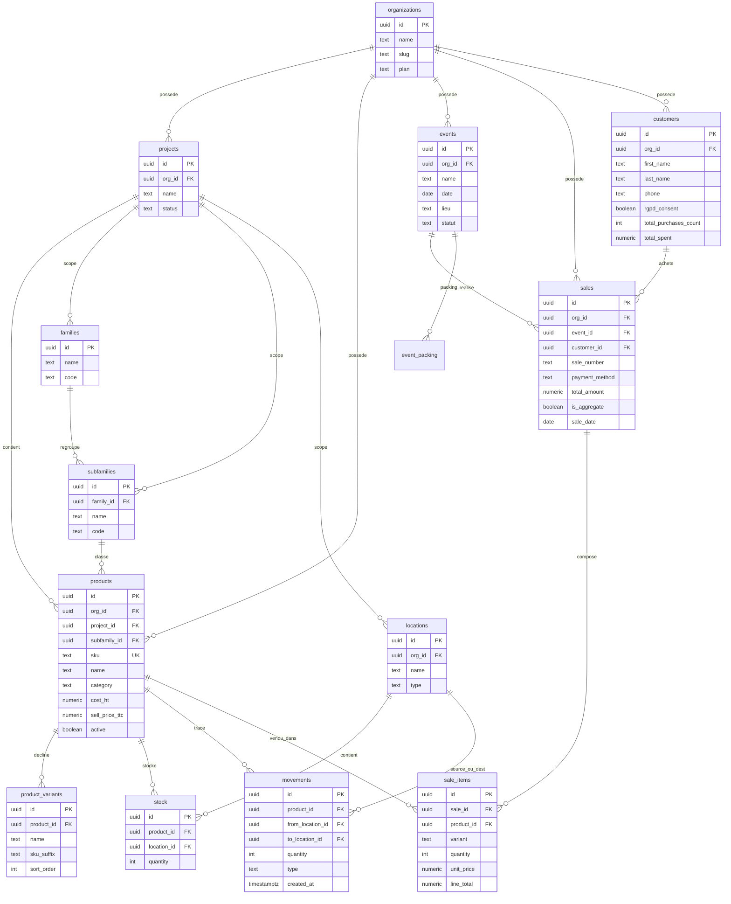

# DOC_SCHEMA_DB — Schema de la base BackStage

**But du document :** te donner une vision claire du contenu de la base Supabase de BackStage, sans jargon inutile. Tu dois pouvoir lire ce fichier, comprendre comment les donnees sont organisees, et raisonner sur les KPIs, les imports et la coherence.

**Version :** Phase N.0b (2026-04-20) — apres reconstruction des ventes merch Arobase et creation de la table `customers`.

---

## Sommaire

1. Vue d'ensemble
2. Diagramme des tables merch (Mermaid)
3. Fiches tables (11 tables centrales)
4. Flux de donnees merch (parcours complet)
5. Regles metier non negociables
6. Snapshot des donnees actuelles
7. Limites actuelles et choses a faire

---

## 1. Vue d'ensemble

### Qu'est-ce que Supabase ?

Supabase est un service qui te fournit une base de donnees **PostgreSQL** (la base SQL la plus robuste du marche) plus une API automatique pour y acceder depuis l'app React. Concretement : tu ranges tes donnees dans des **tables** (comme des feuilles Excel ultra-structurees), et Supabase te donne gratuitement l'authentification, les regles de securite (RLS — Row Level Security) et un acces HTTP a chaque table.

Postgres oblige chaque table a avoir des colonnes typees (texte, nombre, date, uuid...) et des **cles etrangeres** qui relient les tables entre elles. Exemple : dans `sale_items`, la colonne `sale_id` pointe vers l'`id` de la table `sales` — ce qui garantit qu'une ligne de ticket ne peut pas exister sans son ticket.

### Les 6 familles de tables BackStage

| Famille | Tables | Role |
|---|---|---|
| **Catalogue** | `products`, `product_variants`, `families`, `subfamilies` | Le referentiel des articles (SKU, prix, tailles, categories) |
| **Stock** | `locations`, `stock`, `movements` | Inventaire par depot + historique des mouvements |
| **Ventes** | `sales`, `sale_items`, `cash_reports`, `customers` | Tickets de caisse, lignes de ventes, rapports de caisse, CRM clients |
| **Evenements** | `events`, `event_packing`, `checklists` | Concerts / dates de tournee + liste de packing |
| **Equipe** | `organizations`, `projects`, `project_members`, `user_profiles`, `roles` | Multi-tenant, acces utilisateurs, droits |
| **Audit** | `audit_logs`, `feedback` | Traces des actions sensibles et retours terrain |

---

## 2. Diagramme des tables merch

Le diagramme ci-dessous montre uniquement le **coeur merch** (catalogue + stock + ventes + evenements + clients). Les tables Equipe/Audit sont volontairement masquees pour ne pas surcharger.



**Lecture des cardinalites :**
- `||--o{` = "1 cote gauche a N cote droit" (ex : 1 `event` a plusieurs `sales`)
- `PK` = Primary Key (cle primaire, identifiant unique de la ligne)
- `FK` = Foreign Key (cle etrangere, pointeur vers une autre table)
- `UK` = Unique Key (valeur unique dans la table, ex : `sku`)

---

## 3. Fiches tables

### `organizations` — L'entreprise / tenant

**But :** Unite de cloisonnement multi-tenant. Chaque client du SaaS aura son propre `organization`. Aujourd'hui il n'y a qu'EK SHOP (`id = 00000000-0000-0000-0000-000000000001`).

**Colonnes cles :**
| Colonne | Type | Description |
|---|---|---|
| id | uuid | Identifiant unique |
| name | text | Nom affiche (ex : "EK SHOP") |
| slug | text | URL-friendly (ex : "ek-shop") |
| plan | text | free / pro / enterprise |
| settings | jsonb | Parametres custom par org |

**Regles :**
- Toutes les tables metier (`products`, `events`, `sales`...) ont un `org_id` qui pointe ici — c'est ce qui garantit l'isolation entre clients.
- Les policies RLS utilisent `get_user_org_ids()` pour ne laisser voir que les orgs auxquelles l'utilisateur appartient.

---

### `projects` — Les tournees / saisons

**But :** Une org peut avoir plusieurs projets (ex : "EK TOUR 25 ANS", "Tournee Europe 2027"). Chaque produit, depot et famille peut etre scope a un projet precis.

**Colonnes cles :**
| Colonne | Type | Description |
|---|---|---|
| id | uuid | Identifiant unique |
| org_id | uuid | FK vers `organizations` |
| name | text | Nom du projet (ex : "EK TOUR 25 ANS") |
| status | text | active / archive / brouillon |
| created_by | uuid | Utilisateur createur |

**Regles :**
- Projet actif actuel EK TOUR 25 ANS : `id = 718ba138-5249-4106-8d74-a7083cc30202`
- Un `product` sans `project_id` est "orphelin" — voir diagnostic dans `phase-i-bug-fixes.sql`.

---

### `products` — Catalogue articles

**But :** Referentiel des articles vendus ou utilises (merch, materiel, consommables).

**Colonnes cles :**
| Colonne | Type | Description |
|---|---|---|
| id | uuid | Identifiant unique |
| org_id | uuid | FK `organizations` |
| project_id | uuid | FK `projects` (scope tournee) |
| sku | text UNIQUE | Code SKU (ex : `EK-TS-EK25-NOI`) |
| name | text | Libelle (ex : "T-shirt EK 25 Noir") |
| category | text | `merch` / `materiel` / `consommable` |
| subfamily_id | uuid | FK `subfamilies` |
| cost_ht | numeric(12,2) | Prix achat HT EUR |
| sell_price_ttc | numeric(12,2) | Prix vente TTC EUR |
| min_stock | int | Seuil d'alerte rupture |
| active | boolean | Actif / archive |
| product_status | text | active / draft / obsolete |

**Regles :**
- 1 `product` = 1 SKU de reference. Les declinaisons (tailles, coloris) sont dans `product_variants`.
- `active = false` -> masque dans les listes mais conserve en historique (jamais supprime).
- La categorie est la couleur du module (merch=violet, materiel=bleu, consommable=vert — voir charte).

**Saisie type :**
- Ecran Articles -> "Nouvel article"
- Ou import CSV "Maj en masse"

---

### `product_variants` — Declinaisons (tailles, coloris)

**But :** Un T-shirt a plusieurs tailles (S, M, L, XL) et parfois plusieurs coloris. Au lieu de creer 1 `product` par combinaison, on garde 1 seul `product` et on lui rattache N `variants`.

**Colonnes cles :**
| Colonne | Type | Description |
|---|---|---|
| id | uuid | Identifiant unique |
| product_id | uuid | FK `products` |
| name | text | Libelle variante (ex : "M", "Wax noir") |
| sku_suffix | text | Complement SKU (ex : `-M`, `-WAX-NOI`) |
| sort_order | int | Ordre d'affichage |

**Regles :**
- Le SKU complet d'une variante = `products.sku` + `product_variants.sku_suffix`.
- Les variants n'ont pas (encore) de stock propre : le stock est au niveau du `product`. **Limite connue**, a migrer plus tard (voir section 7).

**Saisie type :**
- Ecran ProductDetail -> onglet "Variantes" -> "Ajouter"

---

### `stock` — Inventaire par depot

**But :** Combien d'unites d'un article sont presentes dans un depot, a un instant T. Une ligne = 1 couple (produit, depot).

**Colonnes cles :**
| Colonne | Type | Description |
|---|---|---|
| id | uuid | Identifiant unique |
| product_id | uuid | FK `products` |
| location_id | uuid | FK `locations` |
| quantity | int | Nombre d'unites |
| org_id | uuid | Cloisonnement |

**Regles :**
- Les quantites sont **entieres uniquement** (pas de fractions). L'app applique `replace(/[^0-9]/g, '')` a la saisie.
- `stock.quantity = 0` est conserve (on garde la ligne pour savoir que le produit a deja transite par ce depot).
- Jamais de mise a jour directe depuis le frontend : tous les changements passent par la RPC `move_stock()` qui ecrit aussi dans `movements`.

**Saisie type :**
- Inventaire initial -> ecran Depots -> "Saisir inventaire"
- Reception achat -> ecran Achats -> "Reception"

---

### `movements` — Historique des mouvements

**But :** Trace immuable de chaque entree, sortie ou transfert de stock. C'est le journal comptable du merch.

**Colonnes cles :**
| Colonne | Type | Description |
|---|---|---|
| id | uuid | Identifiant unique |
| product_id | uuid | FK `products` |
| from_location_id | uuid | Depot source (NULL si entree) |
| to_location_id | uuid | Depot destination (NULL si sortie) |
| quantity | int | Nombre d'unites |
| type | text | `entry` / `exit` / `transfer` / `sale` / `loss` |
| reason | text | Motif (ex : "Reception commande #123") |
| created_at | timestamptz | Date/heure du mouvement |
| created_by | uuid | Utilisateur |

**Regles :**
- **Immuable** : on n'UPDATE jamais. Pour corriger, on cree un mouvement inverse via RPC `undo_movement()`.
- Un transfert entre 2 depots = 1 seule ligne `movements` avec `from` et `to` renseignes.
- Une vente concert ne cree pas automatiquement un mouvement aujourd'hui (**limite connue** : le stock n'est pas decremente apres une sale — voir section 7).

**Saisie type :**
- Scanner QR ou ecran Movements -> "Nouveau mouvement"
- Auto lors des RPC `move_stock()`

---

### `events` — Concerts et dates de tournee

**But :** Une date de la tournee : concert live, sound system, festival, etc. Pivot pour rattacher les ventes, le packing, les depenses.

**Colonnes cles :**
| Colonne | Type | Description |
|---|---|---|
| id | uuid | Identifiant unique |
| org_id | uuid | Cloisonnement |
| name | text | Nom (ex : "Concert Arobase J1") |
| date | date | Date de l'event |
| lieu | text | Salle/venue (ex : "Arobase") |
| ville | text | Ville |
| territoire | text | Martinique / Guadeloupe / France / International |
| format | text | Concert live / Sound system / Festival / Impro |
| capacite | int | Jauge attendue |
| statut | text | Prevu / Confirme / Terminer / Annule |

**Regles :**
- Le forecast merch utilise `format` et `territoire` pour calculer le CA attendu (voir CLAUDE.md, section Forecast).
- Un event `Termine` sans `sales` liees = concert sans data merch collectee (voir section 7).

**Saisie type :**
- Ecran Tournee -> "Nouveau concert"
- Ou import CSV "Planning tournee"

---

### `sales` — Tickets de caisse

**But :** Une ligne = un passage en caisse (un client, un paiement, potentiellement plusieurs articles). C'est l'entete du ticket.

**Colonnes cles :**
| Colonne | Type | Description |
|---|---|---|
| id | uuid | Identifiant unique |
| org_id | uuid | Cloisonnement |
| event_id | uuid | FK `events` (concert ou NULL si vente hors concert) |
| customer_id | uuid | FK `customers` (NULL si anonyme) |
| sale_number | text | Numero lisible (ex : `ARO-01`, `GP-07AVR`) |
| payment_method | text | `cash` / `card` / `mobile` / `mixed` / `free` |
| total_amount | numeric(12,2) | Total TTC du ticket |
| items_count | int | Nb articles total (agregat) |
| is_aggregate | boolean | **TRUE = bilan concert global, pas un ticket individuel** |
| sale_date | date | Date effective (= date concert) |
| created_at | timestamptz | Date d'import/saisie (peut differer) |
| sold_by | uuid | Equipier caisse |
| notes | text | Libre |

**Regles :**
- `total_amount` doit toujours egaler `SUM(sale_items.line_total)` pour la meme `sale_id`.
- `is_aggregate = true` signifie "bilan concert tout en un" (ex : Lamentin 07/04 dont on n'a pas les tickets individuels). **Ces sales sont exclues du KPI panier moyen.**
- `customer_id` nullable car la plupart des ventes stand sont anonymes.

**Saisie type :**
- Ecran LiveShop (mode concert) -> encaissement
- Ou import SumUp CSV -> 1 ligne = 1 sale

---

### `sale_items` — Lignes de ticket

**But :** Le detail des articles d'un ticket. 1 ticket de 3 produits = 3 lignes `sale_items`.

**Colonnes cles :**
| Colonne | Type | Description |
|---|---|---|
| id | uuid | Identifiant unique |
| sale_id | uuid | FK `sales` (CASCADE delete) |
| product_id | uuid | FK `products` (SET NULL si produit supprime) |
| variant | text | **Champ texte libre** (ex : "M", "Wax noir") — PAS encore une FK vers `product_variants` |
| quantity | int | Nb d'unites |
| unit_price | numeric(12,2) | Prix unitaire TTC |
| line_total | numeric(12,2) | quantity x unit_price |

**Regles :**
- `line_total = quantity * unit_price` : calcule cote frontend, stocke tel quel (redondance assumee pour eviter les recalculs SQL).
- Pour une vente **offerte** (ex : Polo offert au patron Arobase) : `unit_price = 0`, `line_total = 0`, mais la ligne est conservee (pas d'exclusion du reporting).
- `variant` en TEXT et non en FK -> limite a corriger plus tard.

---

### `customers` — CRM clients (RGPD)

**But :** Base clients consolidee a partir des concerts, du site e-commerce (futur), et des imports. Respect RGPD strict.

**Colonnes cles :**
| Colonne | Type | Description |
|---|---|---|
| id | uuid | Identifiant unique |
| org_id | uuid | Cloisonnement |
| first_name / last_name | text | Nom |
| phone / email / address / city / postal_code | text | Contact |
| rgpd_consent | boolean | Consentement explicite (default `false`) |
| rgpd_consent_date | timestamptz | Horodatage du consentement |
| marketing_consent | boolean | Autorisation newsletter (default `false`) |
| source | text | `concert` / `site` / `bizouk` / `import` / `manuel` |
| first_purchase_at / last_purchase_at | timestamptz | Bornes d'achat |
| total_purchases_count | int | Nb de tickets |
| total_spent | numeric(12,2) | CA cumule |
| notes | text | Libre |

**Regles :**
- **`rgpd_consent = false` par defaut** : le client n'est PAS dans la cible marketing tant qu'il n'a pas explicitement coche. C'est non negociable.
- Les 3 premiers customers (Rene Coail, Roselyne Nestoret, Catherine Beroard-Gabbidom) viennent du fichier Excel concert Arobase 20-21/03. Ils n'ont pas encore consenti formellement — marketing interdit.
- Les champs `total_*` sont recalcules apres chaque insert de `sales` (voir Phase N.0b, section 7).

**Saisie type :**
- Ecran Clients -> "Nouveau client" (mode manuel)
- Auto depuis LiveShop quand on saisit un telephone ou email
- Import Excel/CSV -> via script SQL

---

### `audit_logs` — Traces des actions sensibles

**But :** Historique immuable des actions importantes (suppression, changement de role, invitation, export donnees). Utile pour la conformite et le debug.

**Colonnes cles :**
| Colonne | Type | Description |
|---|---|---|
| id | uuid | Identifiant unique |
| action | text | Code action (ex : `product.delete`, `member.invite`) |
| user_id | uuid | Qui a fait l'action |
| org_id | uuid | Quel tenant |
| target_type | text | Type de la cible (ex : `product`, `sale`) |
| target_id | uuid | ID de la cible |
| details | jsonb | Payload libre (avant/apres, metadata) |
| created_at | timestamptz | Quand |

**Regles :**
- **Immuable** : pas de UPDATE ni DELETE possibles (RLS deny par defaut).
- SELECT autorise uniquement a l'utilisateur lui-meme ou aux admins de l'org.
- Alimentee par le helper `src/lib/auditLog.js`.

---

## 4. Flux de donnees merch (parcours complet)

Voici le parcours concret depuis la creation d'un article jusqu'au KPI affiche dans le dashboard.

### Etape 1 — Creation d'un article
**Action :** Gio cree "T-shirt EK 25 Noir" via l'ecran Articles.
**SQL :**
```sql
INSERT INTO products (org_id, project_id, sku, name, category, cost_ht, sell_price_ttc, ...)
VALUES ('...', '...', 'EK-TS-EK25-NOI', 'T-shirt EK 25 Noir', 'merch', 5.00, 25.00, ...);
```
Si tailles : on ajoute 4 lignes dans `product_variants` (S, M, L, XL).

### Etape 2 — Arrivee du stock
**Action :** La commande de 400 T-shirts arrive au depot Ducos.
**SQL :**
```sql
INSERT INTO stock (product_id, location_id, quantity, org_id) VALUES ('...', '...', 400, '...');
INSERT INTO movements (product_id, to_location_id, quantity, type, reason, ...)
VALUES ('...', '...', 400, 'entry', 'Reception commande fournisseur', ...);
```
(En realite via la RPC `move_stock()` qui fait les deux d'un coup.)

### Etape 3 — Transfert inter-depots
**Action :** On envoie 50 T-shirts de Ducos vers Fort-de-France (avant le concert).
**SQL (via RPC) :**
```sql
SELECT move_stock(product_id := '...', from_loc := 'Ducos', to_loc := 'FDF', qty := 50);
```
Effet : UPDATE `stock` (−50 a Ducos, +50 a FDF) + INSERT `movements` (type `transfer`).

### Etape 4 — Planification du concert
**Action :** Concert Arobase 20/03 cree dans l'ecran Tournee.
**SQL :**
```sql
INSERT INTO events (name, date, lieu, format, territoire, statut, ...)
VALUES ('Concert Arobase J1', '2026-03-20', 'Arobase', 'Concert live', 'Martinique', 'Confirme', ...);
```

### Etape 5 — Ventes du concert
**Action :** Sur place, 9 tickets sont encaisses. Pour chaque ticket :
**SQL :**
```sql
-- Entete
INSERT INTO sales (event_id, sale_number, payment_method, total_amount, sale_date, ...)
VALUES (event_arobase, 'ARO-01', 'card', 50.00, '2026-03-20', ...) RETURNING id;

-- Lignes
INSERT INTO sale_items (sale_id, product_id, variant, quantity, unit_price, line_total)
VALUES (sale_id, ts_ek25_noir, 'M', 2, 25.00, 50.00);
```
Le ticket Arobase #1 a 2 lignes : 2x T-shirt (50€) + 1 Polo offert (0€).

### Etape 6 — Client identifie
**Action :** Rene Coail donne son nom, Gio le saisit.
**SQL :**
```sql
INSERT INTO customers (first_name, last_name, rgpd_consent, source, ...)
VALUES ('Rene', 'Coail', false, 'concert', ...) RETURNING id;

UPDATE sales SET customer_id = '...' WHERE id = '...';
```
Le trigger recalcule `customers.total_purchases_count` et `total_spent` pour Rene.

### Etape 7 — KPI calcule
**Action :** Le dashboard affiche "CA Arobase : 300€, 9 tickets, panier moyen 33€".
**SQL (frontend ou vue) :**
```sql
SELECT SUM(total_amount) AS ca,
       COUNT(*) AS nb_tickets,
       AVG(total_amount) AS panier_moyen
FROM sales
WHERE event_id = '...' AND is_aggregate = false;
```
Note : le filtre `is_aggregate = false` exclut les bilans agreges (Lamentin).

---

## 5. Regles metier non negociables

Ces regles sont critiques. Toute deviation = bug ou incoherence comptable.

### Ventes et paniers

- **`sales.is_aggregate = true`** -> bilan concert agrege (ex : Lamentin 07/04). **Exclu** du KPI panier moyen et du nombre de tickets reels.
- **`sales.total_amount = SUM(sale_items.line_total)`** -> verifier a chaque insert/update. Si pas egal, c'est une incoherence a detecter.
- **`sale_items.line_total = quantity x unit_price`** -> calcule cote frontend, stocke tel quel (redondance volontaire).
- **Ventes gratuites / offertes** -> `unit_price = 0` et `line_total = 0`. La ligne est conservee dans `sale_items` (pas d'exclusion du reporting, on veut tracer les produits offerts).
- **Paiement mixte** -> `payment_method = 'mixed'`, le detail cash/card sera stocke dans `cash_reports` ou dans `notes`.

### Clients et RGPD

- **`customers.rgpd_consent = false` par defaut** -> pas de marketing, pas de newsletter, pas d'export tiers tant que le client n'a pas coche explicitement.
- **Suppression RGPD** (droit a l'oubli) -> anonymiser (`first_name = '[supprime]'`, `phone = NULL`) plutot que DELETE, pour conserver les `sales` liees.

### Comptabilite francaise

- **Tous les prix en `numeric(12,2)`** (jamais `float`) pour la precision centimes.
- **Amortissement lineaire** uniquement, prorata base 360 jours. Seuil immobilisation : 500€ HT.
- **Consommables** (cat. `consommable`) = charges comptables, jamais amortis.
- **Monnaie** : EUR implicite partout. Pas de multi-devise pour l'instant.

### Stock et mouvements

- **`movements` est immuable** : pas d'UPDATE. Pour corriger, creer un mouvement inverse via `undo_movement()`.
- **Quantites entieres uniquement** : `replace(/[^0-9]/g, '')` a la saisie cote frontend.
- **`stock.quantity` ne doit jamais etre negatif** (a verifier dans la RPC `move_stock`).

### Multi-tenant

- **Chaque table metier a `org_id`** et une RLS qui filtre sur `get_user_org_ids(auth.uid())`. C'est ce qui garantit qu'un client SaaS ne voit pas les donnees d'un autre.
- **Nouvelles tables** -> RLS activee obligatoire, policy SELECT/INSERT/UPDATE/DELETE sur `org_id`.

---

## 6. Snapshot des donnees actuelles

Comptage au **2026-04-20** (apres application de `phase-n0b-data-reconstruction.sql`) :

| Table | Nb lignes | Note |
|---|---|---|
| organizations | 1 | EK SHOP |
| projects | 1 | EK TOUR 25 ANS |
| products | 21 | Referentiel initial (V2 post phase-i) |
| product_variants | 24 | 13 existants + 11 nouveaux (T-shirt unique, col V, pailletee, Polo F) |
| families | 3 | MERCH, MAT, CONSO |
| subfamilies | 17 | 6 merch + 5 materiel + 6 consommables |
| events | 24 | 7 Termines (2 avec data : Arobase + Lamentin, 5 sans data) |
| sales | 10 | 9 tickets Arobase + 1 bilan Lamentin |
| sale_items | 19 | Detail des articles vendus (11 Arobase + 8 Lamentin) |
| customers | 3 | Rene Coail, Roselyne Nestoret, Catherine Beroard-Gabbidom (RGPD : non consentement) |
| audit_logs | ? | A confirmer (cree en phase-a) |
| locations | ? | A confirmer (depots Ducos, FDF, stand concert...) |
| stock | ? | A confirmer |
| movements | ? | A confirmer |

**CA Arobase total :** 300€ (verifie par le DO $$ de la migration N.0b).

---

## 7. Ce qui reste a faire / limites actuelles

### Data manquante

- **5 concerts Termines sans data merch** : Arobase J2 21/03 (partiellement, seulement 3 tickets sur 6 identifies), Awarak, Studio, Jardin de Wael (11/04), Atelier Bougie. A reconstruire si possible, sinon accepter la perte.
- **Lamentin 07/04 est en bilan agrege** (`is_aggregate = true`). A eclater en tickets individuels via l'import SumUp ticket-par-ticket (Phase N.1).
- **Prix d'achat (`cost_ht`) incomplets** sur environ 15 produits (valeur par defaut 1€). Necessite de reprendre les factures fournisseurs pour la marge reelle.

### Connecteurs externes

- **Pas de connecteur SumUp** (import CSV manuel pour l'instant). Prevu Phase N.1.
- **Pas de connecteur Squarespace** (ventes e-commerce site EK SHOP). Prevu Phase N.1.
- **Pas de connecteur Bizouk** (ventes digitales / MP3). Prevu Phase N.2.

### Schema a faire evoluer

- **Pas de table dediee pour les ventes digitales** (MP3, telechargements Squarespace). Aujourd'hui on les insererait dans `sales` avec `event_id = NULL` et `source = 'site'` dans les notes — pas propre.
- **`sale_items.variant` est un champ TEXT**, pas une FK vers `product_variants.id`. A migrer quand on aura stabilise les variants. Impact : si on renomme un variant, les ventes passees n'en savent rien.
- **Stock au niveau produit, pas au niveau variant** : aujourd'hui impossible de savoir combien de T-shirts M vs L en stock. Prevu Phase N.3.
- **Pas de table `product_prices_history`** : si on change un prix, on perd l'ancien. A considerer.

### RLS et securite

- Certaines policies `USING (true)` sur `sales`, `sale_items`, `cash_reports` sont **trop permissives** (voir `create-sales-pos.sql`). A durcir en filtrant sur `org_id` comme pour `customers`.

---

**Fin du document.** Pour toute question ou incoherence detectee, creer un ticket dans `A-faire.md` avec la reference a la section de ce doc.
